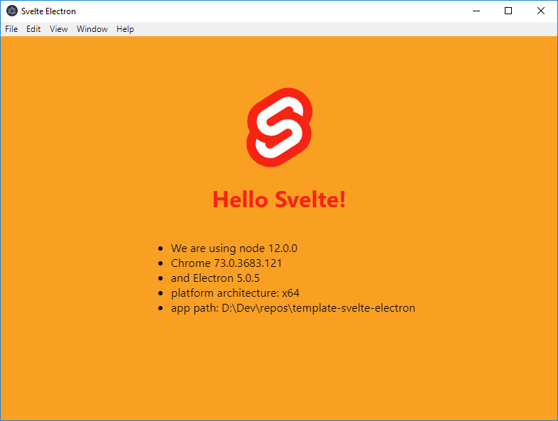

# Svelte Electron Template

The bare minimum boilerplate to use svelte in electron



## Quick start

`npm start` to build, bundle, and watch the svelte app, then load it as renderer thread in an electon app.

## Import modules for **browser**

Use ES6 `import`. The modules will be bundled.

```javascript
// you can import from relative path
import MyComponent from './MyComponent.svelte';
import { myUtilFunc } from './MyUtilFunc';

// or from node modules
import { writable } from 'svelte/store';
```

## Import modules for **node**

Use CommonJS `require()`. The modules will NOT be bundled. The import will be resolved at runtime.

```javascript
const app = require('electron').remote.app;
const path = require('path');
const fs = require('fs');

// DON'T do this. It will NOT be bundled!
const { writable } = require('svelte/store');
```
